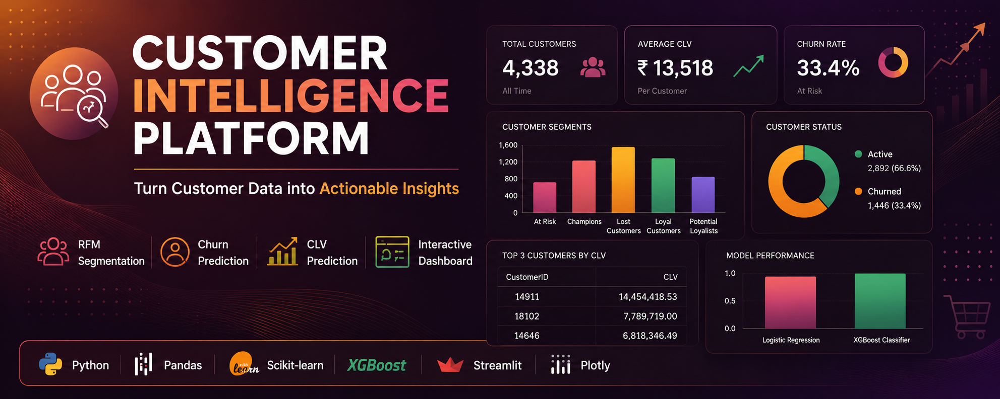
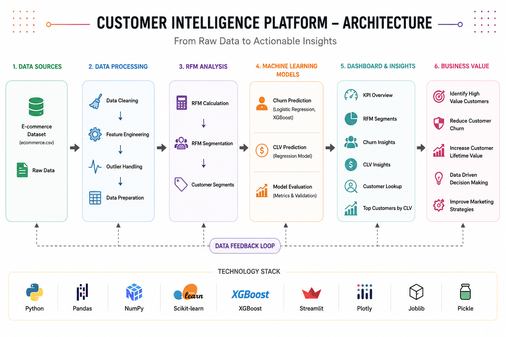
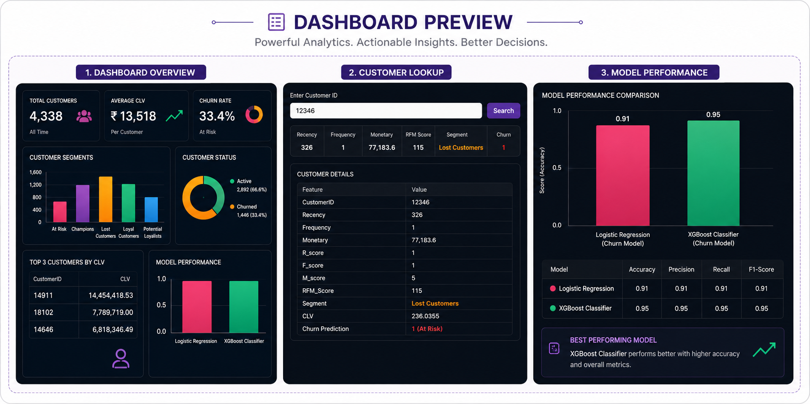

<p align="center">
  
</p>

<h1 align="center">Customer Intelligence Platform</h1>

<p align="center">
An end-to-end Machine Learning and Business Analytics platform for Customer Segmentation, Churn Prediction, Customer Lifetime Value (CLV) Prediction, and Interactive Business Intelligence Dashboard.
</p>

<p align="center">


</p>

---

# 📌 Overview

Customer Intelligence Platform is an end-to-end customer analytics solution that transforms raw e-commerce transaction data into meaningful business insights using Machine Learning and Business Intelligence techniques.

The platform enables businesses to identify valuable customers, predict customer churn, estimate Customer Lifetime Value (CLV), perform RFM segmentation, and visualize insights through an interactive dashboard.

---

# 🎯 Business Problem

Modern businesses often struggle to answer questions like:

- Which customers are most valuable?
- Which customers are likely to churn?
- What is the expected lifetime value of each customer?
- How can marketing campaigns be personalized?
- How can customer retention be improved?

This project addresses these challenges through customer analytics and predictive machine learning models.

---

# 🏗️ System Architecture

<p align="center">
  
</p>

---

# ✨ Features

- 📊 Interactive Business Dashboard
- 👥 RFM Customer Segmentation
- 📉 Customer Churn Prediction
- 💰 Customer Lifetime Value (CLV) Prediction
- 🔍 Customer Lookup
- 🏆 Top Customers by CLV
- 📈 KPI Monitoring
- 🤖 Machine Learning Models
- 📊 Model Performance Comparison
- ⚡ Streamlit Web Application

---

# 🤖 Machine Learning Models

| Model | Purpose |
|--------|----------|
| Logistic Regression | Customer Churn Prediction |
| XGBoost Classifier | Customer Churn Classification |
| Regression Model | Customer Lifetime Value Prediction |

---

# 🛠️ Tech Stack

| Category | Technology |
|-----------|------------|
| Programming Language | Python |
| Data Processing | Pandas, NumPy |
| Machine Learning | Scikit-Learn, XGBoost |
| Dashboard | Streamlit |
| Visualization | Plotly |
| Model Serialization | Joblib, Pickle |

---

# 📂 Project Structure

```text
Customer-Intelligence-Platform/
│
├── assets/
│   └── banner.png
│
├── architecture/
│   └── architecture.png
│
├── dashboard/
│
├── data/
│   ├── ecommerce.csv
│   ├── customer_intelligence_final.csv
│   └── rfm_data.csv
│
├── models/
│   ├── logistic_model.pkl
│   ├── xgb_model.pkl
│   └── clv_model.pkl
│
├── notebooks/
│   ├── 01_data_cleaning.ipynb
│   ├── 02_churn_prediction.ipynb
│   └── 03_clv_prediction.ipynb
│
├── screenshots/
│   └── dashboard-preview.png
│
├── src/
│
├── app.py
├── requirements.txt
└── README.md
```

---

# 📸 Dashboard Preview

<p align="center">
  
</p>

---

# 📊 Dashboard Modules

- KPI Overview
- Customer Segmentation
- Customer Status Distribution
- Customer Lookup
- Top Customers by CLV
- Customer Lifetime Value Prediction
- Churn Prediction
- Model Performance Comparison

---

# 🚀 Installation

Clone the repository

```bash
git clone https://github.com/<your-username>/Customer-Intelligence-Platform.git
```

Move into the project directory

```bash
cd Customer-Intelligence-Platform
```

Install dependencies

```bash
pip install -r requirements.txt
```

Run the Streamlit application

```bash
streamlit run app.py
```

---

# 🔮 Future Improvements

- Explainable AI using SHAP
- Deep Learning based CLV Prediction
- Recommendation System
- Automated Model Retraining
- Cloud Deployment
- Real-Time Data Streaming
- User Authentication
- Sales Forecasting

---

# 👨‍💻 Author

**Veer Jariwala**

Electronics and Communication Engineering  
National Institute of Technology Tiruchirappalli (NIT Trichy)

---

## 📜 License

This project is licensed under the MIT License.